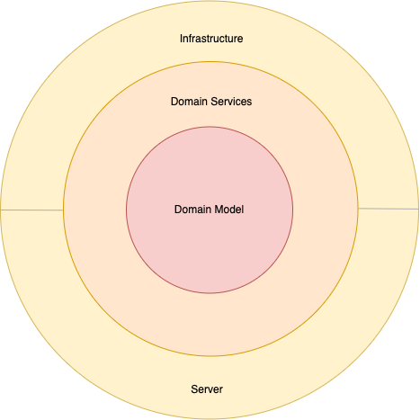

# scala-pet-store-example-api

The goal for this project is to learn how to build an application using Domain Driven Design, Onion Architecture, and modern FP concepts, libraries and techniques in Scala.

## Stack

TypeLevel: 

- **Http4s** as the web server
- **Circe** for json serialization
- **Doobie** for database access
- **Cats** for functional programming goodness
- **Circe Config** for app config


## Architecture

By using the **Onion** architecture pattern to build our API, we can run our application independently of any frameworks while keeping it maintainable and fully testable, also allowing it to be equally driven by users, programs, automated tests or batch scripts and to be developed and tested in isolation from its runtime devices and databases. 

In this architecture all the coupling is towards the center, so at the core we have the domain model and services which represent a state and behaviour combo that models the truth for the application. 

Out on the edges we see Infrastructure and Server (we could also add Tests and UI for instance). The outer layer is reserved for things that change often. Since this type of architecture depends heavily on the **Dependency Inversion Principle**, these things should be intentionally isolated from the application core.



## Reader, algebra and interpreter

A module, as defined in a functional domain model, is a collection of functions that operates on a set of types and honor a set of invariants known (in mathematical terms) as the algebra of the module.

In this case, the algebra is our published contract of the domain that we are modeling. This contract exposes the operations related to our domain model.

As our algebra is a contract, it is not a concrete implementation, an advantage of that fact is that we can create different implementations of the same contract. That is, we need to give an implementation to the operations of our domain and we can do it depending on the context. So for each algebraic contract we have a service and JDBC interpreter that contain implementation details for that specific domain model.

### Project Structure

```bash
.
├── src
│   └── main
│       ├── resources
│       │   ├── db
│       │   │   └── migration
│       │   ├── logback.xml
│       │   └── reference.conf
│       └── scala
│           └── petstore
│               ├── Server.scala
│               ├── config
│               │   ├── DatabaseConfig.scala
│               │   ├── PetStoreConfig.scala
│               │   └── package.scala
│               ├── domain
│               │   ├── ValidationError.scala
│               │   ├── authentication
│               │   │   ├── Auth.scala
│               │   │   └── LoginRequest.scala
│               │   └── users
│               │       ├── Role.scala
│               │       ├── User.scala
│               │       ├── UserRepositoryAlgebra.scala
│               │       ├── UserService.scala
│               │       ├── UserValidationAlgebra.scala
│               │       └── UserValidationInterpreter.scala
│               └── infrastructure
│                   ├── endpoint
│                   │   ├── Pagination.scala
│                   │   ├── UserEndpoints.scala
│                   │   └── package.scala
│                   └── repository
│                       ├── doobie
│                       │   ├── DoobieAuthRepositoryInterpreter.scala
│                       │   ├── DoobieUserRepositoryInterpreter.scala
│                       │   └── Pagination.scala
│                       └── inmemory
│                           └── UserRepositoryInMemoryInterpreter.scala

```

#### The domain package 

The `domain` package constitutes the things inside our domain. It is deliberately free of the ugliness of JDBC, JSON, HTTP, and the rest. We use Services as coarse-grained interfaces to our domain. These typically represent real-world use cases. 

Inside of the `domain`, we have:

1. `Service` - the coarse grained use cases that work with other domain concepts to realize our use-cases

2. `Repository` - ways to get data into and out of persistent storage. 
>**Important**: Repositories do not have any business logic in them, they should not know about the context in which they are used, and should not leak details of their implementations into the world.

3. `models` - things like `Pet`, `Order`, and `User` are all domain objects. We keep these lean (i.e. free of behavior). All of the behavior comes via `Validations` and `Services`

#### The infrastructure package 

The `infrastructure` package is where the ugliness lives. It has HTTP things, JDBC things, and the like.

1. `endpoint` - contains the HTTP endpoints that we surface via http4s. You will also typically see JSON things in here via circe

2. `repository` - contains the JDBC code, implementations of our `Repositories`.

#### The config package 

The `config` package could be considered infrastructure, as it has nothing to do with the domain. We use Circe Config to load configuration objects when the application starts up. 

Circe config Provides a neat mapping of config file to case classes for us, so we really do not have to do any code.